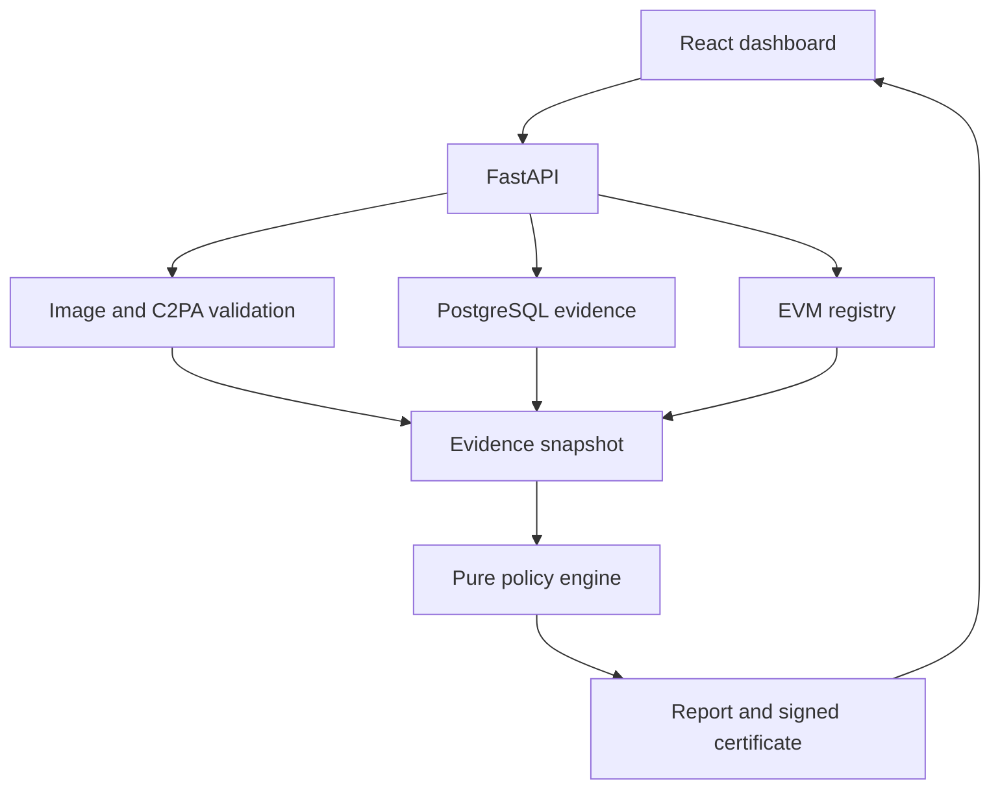

# Architecture

The browser sends an image or a browser-computed SHA-256 to FastAPI. Image bytes are validated in memory using a pinned Pillow decoder. SHA-256, canonical RGB(A) pixel hashing, perceptual discovery and embedded C2PA validation produce an evidence snapshot. PostgreSQL stores registered version fingerprints, signed events, public actors, corroboration blobs and opted-in history. The snapshot builder checks the configured EVM registry on every verification. The pure policy engine receives only the snapshot, versioned policy and explicit clock.

## Binding and trust

B1 hashes the original file bytes. B2 hashes dimensions, mode and pixel bytes after EXIF orientation, with a versioned domain prefix. An opaque RGB image and an RGBA image remain distinct because alpha can carry meaningful information. B3 is the signed input/output relationship, evaluated when following parents. Exact B1/B2 lookup remains the strongest displayed binding for registered exports; signed derivation details are on graph edges. B5 candidates are never followed as signed parents.

Events contain ordered parent event IDs and corresponding consumed artifact hashes. The EIP-712 digest binds all fields, including the canonical public parameter hash and private Merkle root. Parent references are traversed iteratively, with cycle and node limits. Unknown parents remain explicit nodes. Version registration is independent of accepting a claim; an invalid signed claim is rejected on ingestion or classified invalid if a stored snapshot fails subsequent re-verification.

## Storage and concurrency

Event, event-parent, corroboration and audit tables reject updates and deletes through database triggers installed by Alembic. The audit chain uses a transaction-scoped PostgreSQL advisory lock to serialize append operations. Unique file hashes prevent duplicate versions; concurrent collisions return an explicit 409. Version IDs, lineage IDs and report IDs use readable prefixes plus random 64-bit suffixes. These are display IDs; cryptographic event identities are full 256-bit hashes. Browser history isolation uses a separate 256-bit random cookie whose hash is stored as the owner capability.

Raw uploaded files are not persisted. Registrants may opt into a recompressed 256px thumbnail with metadata removed. Unsaved reports live in a bounded, owner-scoped 30-minute cache. Saved reports remain in PostgreSQL. C2PA manifests are reduced to public validation summaries and a digest rather than storing potentially private assertions.

## Runtime

Development Compose contains PostgreSQL 16, Hardhat, FastAPI and nginx. Production Compose uses an external EVM RPC, PostgreSQL, FastAPI, nginx and Caddy TLS termination. The frontend uses TanStack Query, generated OpenAPI types, React Router, React Flow and dagre. No AI model inference is implemented. Demo providers are procedural generators explicitly labelled SIMULATED.
